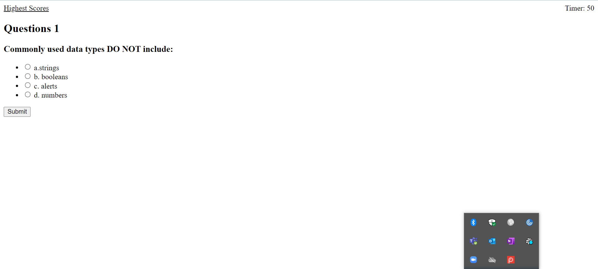

# Code Quiz

## __Description__

This is a Quiz to test a users knowledge on coding. There is 5 questions and you have 60 seconds to answer. Time is added or dedcuted based on if you get the answer right or wrong. At the end a score is give to show how well you ave done.

---
### __Table of Contents__

- [Description](#description)
- [MockUp](#Mockup)
- [Link to Work](#LinkToWork) 

---
## __Mockup__

The following landing page shows the web application's appearance and functionality should be. 

## Link To Work

https://kilowattdot.github.io/CodeQuiz/

